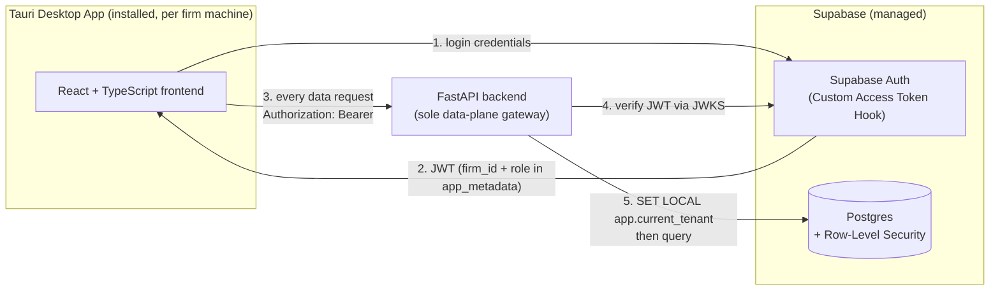

# CA Firm Practice Management Tool — Technical Architecture

> Follows `docs/PRD.md` (v2). Nothing here is implementation — no code exists yet. This document exists so every architectural decision is written down and reasoned about before `docs/DATA_MODEL.md`, `docs/DEPLOYMENT.md`, and the API spec doc are written on top of it.

## 1. Overview & Goals

Single firm, ~10 users, today. Every decision below is made so that scaling toward ~2000 tenants later needs no rebuild — not because multi-tenancy is being built now (it isn't, see §5 and PRD §6), but because retrofitting tenant-awareness onto an application that was never designed for it is a much bigger project than building it in from day one when there are few call sites to touch.

Fixed constraints, already decided, not reopened here: **FastAPI** backend, **Supabase** (Postgres + Auth), **Tauri**-installed desktop app, **React + TypeScript** frontend.

## 2. System Diagram



Two things worth being explicit about, because they're easy to draw wrong:
- The frontend talks to Supabase Auth **directly** for login (step 1-2), but **never** talks to Postgres/PostgREST directly for data. FastAPI is the sole data-plane gateway (step 3-5). This matters for where authorization logic can safely live — see §4 and §5.
- Supabase Auth and Postgres are one managed product, but architecturally they're two different trust boundaries: Auth issues identity, Postgres (via RLS) enforces isolation. Both are required; neither substitutes for the other (see §5).

## 3. Component Responsibilities

| Component | Responsible for | Explicitly NOT responsible for |
|---|---|---|
| Tauri shell | OS packaging, installer, native window | Any business logic |
| React frontend | Session storage, role-based routing (UX only), forms, notification polling (§8) | Authorization decisions — never trusted as a security boundary |
| FastAPI | The only party trusted to authorize anything; verifies every JWT itself on every request; role-based visibility (owner vs. employee) | Storing the source of truth (Postgres does) |
| Supabase Postgres | Source of truth; RLS as the tenant-isolation safety net (§5) | Role-based (owner/employee) authorization — that's FastAPI's job, not RLS's, in this phase (§5) |
| Supabase Auth | Credential verification, JWT issuance, Custom Access Token Hook (§4) | Authorizing individual API calls — FastAPI re-verifies independently every time |

## 4. Authentication Flow

Confirmed decision: **frontend → Supabase Auth directly** for login, not proxied through FastAPI. This is the standard, lower-surface-area Supabase pattern — don't reimplement credential verification FastAPI would just delegate to Supabase anyway. It's fully compatible with PRD §5 ("the backend verifies credentials and routes by role"): FastAPI still independently re-verifies and authorizes every subsequent call, so no security step is skipped — only *where the password check itself happens* changes.

**Step by step:**

1. Login page (PRD §5, single page) submits credentials directly to Supabase Auth.
2. Supabase Auth verifies credentials. At token-issue time, the **Custom Access Token Hook** (`public.custom_access_token_hook`, a Postgres function granted only to `supabase_auth_admin`, revoked from `authenticated`/`anon`/`public` — built as an actual migration, `a8e6def15927`, 2026-09-05, having gone undescribed as real SQL until Phase 4's frontend work needed it) reads the `profiles` table (`user_id`, `firm_id`, `role`, `must_change_password`) and injects `firm_id` + `role` + `must_change_password` into `app_metadata` claims. Note: Supabase's own top-level `role` claim means the *Postgres role* (`authenticated`) — the app-level Owner/Employee role must live under `app_metadata`, never colliding with that. `must_change_password` is included so the frontend can route to the forced Set New Password screen (§ below) without needing direct Postgres/PostgREST access, which the System Diagram above already rules out — same staleness caveat as `firm_id`/`role` (token-lifetime-scoped, not live), acceptable here because it only drives client-side *routing*; the frontend forces a session refresh right after Set New Password succeeds so the UI doesn't wait out the token's remaining lifetime.
3. Frontend receives the JWT, decodes `app_metadata.role`/`app_metadata.must_change_password` locally to route to the Owner or Employee dashboard or the forced Set New Password screen (UX only — not a security decision), stores the token in Tauri secure storage, attaches it as `Authorization: Bearer` on every FastAPI call.
4. FastAPI verifies the JWT **independently on every request**, via the Supabase project's JWKS endpoint using a real JWT library — never shared-secret HS256 verification (explicitly discouraged by Supabase's own docs: "almost no benefit... can expose your project's data to significant security vulnerabilities"). **Made explicit 2026-09-03** — "a real JWT library handles it" was too vague to hand to whoever writes this function; `supabase/auth/jwt-fields.md`'s own validation checklist, cross-checked against `owasp-asvs-5/chapters/v9-self-contained-tokens.md`, is the actual spec:
   - Algorithm allowlist — accept only the algorithm Supabase's JWKS advertises for this key (`RS256`/`ES256` on the asymmetric signing keys this project uses per §"connection role" below — never fall back to accepting `HS256` or `none` even if a token claims one) — ASVS 9.1.2 (L1).
   - Key source — fetch verification keys only from the project's own JWKS endpoint, never a `jku`/`x5u` header value inside the token itself — ASVS 9.1.3 (L1).
   - `exp` (and `nbf` if present) checked against current time — ASVS 9.2.1 (L1); `jwt-fields.md` checklist item 3.
   - `iss` matches this Supabase project's own issuer URL — `jwt-fields.md` checklist item 4.
   - `aud` matches `"authenticated"` (the value Supabase issues for signed-in users, `jwt-fields.md`) — ASVS 9.2.3 (L2); most JWT libraries **do not check this by default** unless the audience is passed explicitly to the verify call, worth naming so it isn't silently skipped.
5. A `CurrentProfile` FastAPI dependency decodes `firm_id` + `role` from the verified token once per request. `require_owner` and similar role-gate dependencies compose on top of it (§11). **`CurrentProfile` also fetches `profiles.is_active` fresh from the database on every request (a single indexed PK lookup by user id) and rejects with 401 if `false`** — see the resolved finding immediately below for why this can't be satisfied by the token alone.
6. At the start of the DB transaction for that request, FastAPI runs `SET LOCAL app.current_tenant = '<firm_id>'` so Postgres RLS can enforce the tenant boundary (§5).

**Resolved 2026-09-03 — deactivation must be checked live, not trusted from the JWT.** Checked directly
against `supabase/auth/sessions.md`, `supabase/auth/signout.md`, and `supabase/auth/managing-user-data.md`
after the earlier passes over this flow stopped at "JWT verified independently" without asking what happens
*after* an account is deactivated. The honest answer, in Supabase's own words: **nothing, by default.**
`signout.md`: *"Access Tokens of revoked sessions remain valid until their expiry time... The user won't be
immediately logged out."* `managing-user-data.md`: a ban *"does not revoke existing sessions,"* and even
`auth.admin.deleteUser()` only stops the account from minting *new* access tokens — the one already in the
employee's hand keeps working until its own `exp`. Default token lifetime is 1 hour
(`supabase/auth/sessions.md`), and the Custom Access Token Hook re-runs on every refresh
(`authentication_method: "token_refresh"`, `supabase/auth/auth-hooks/custom-access-token-hook.md`) but only
ever reads `firm_id`/`role` — it was never asked about `is_active`, so a deactivated employee's session keeps
silently refreshing forever, not just for the remaining hour. This is exactly the "self-contained tokens need
extra work to revoke before natural expiry" case `owasp-asvs-5/chapters/v7-session-management.md` names
outright, and 7.4.2 ("all active sessions terminate when an account is disabled") is **Level 1** — baseline,
not a stretch goal. **Fix:** `CurrentProfile` re-fetches `is_active` from `profiles` on every request instead
of trusting the token for it (step 5 above) — `firm_id`/`role` stay JWT-sourced since neither ever changes
post-creation in this app (no role-reassignment or firm-transfer feature exists), so only the one field that
*can* change post-issuance gets re-checked. This trades one extra indexed row read per request for actually
closing the gap — cheap at 10-user scale, and the honest alternative (a session/token denylist,
`owasp-cheatsheets/JSON_Web_Token_Cheat_Sheet.md`'s revocation section) would be real infrastructure for a
problem this single query already solves. Deactivation now takes effect on an Employee's *next* API call, not
after up to an hour or never.

**Security requirements applied here, from this project's own skill library** (per the standing instruction to check every component against `owasp-cheatsheets` and `owasp-asvs-5`, not just the API spec stage):
- `Authentication_Cheat_Sheet.md`, `Password_Storage_Cheat_Sheet.md` — verification, not implementation, role: Supabase owns password hashing (adaptive hashing, already meets the bar), we don't reimplement it. Confirmed via login going directly to Supabase Auth (this section).
- `Multifactor_Authentication_Cheat_Sheet.md` — not built this phase (PRD has no MFA requirement), noted here so it's a deliberate omission, not a forgotten one.
- **Login brute-force protection — checked, not confirmed, flagged rather than assumed.** ASVS 6.3.1 (L1):
  "credential-stuffing/brute-force controls implemented per documented policy." `supabase/auth/rate-limits.md`
  documents Supabase's own IP-based rate limits in detail — but its table lists signup, OTP, `verify`, token
  *refresh*, and MFA endpoints explicitly, and **does not list a row for plain email+password sign-in itself**
  (`/auth/v1/token?grant_type=password`). This may just be an incomplete table rather than an actual gap —
  stated honestly as unconfirmed by this skill either way, not silently assumed safe. **Required pre-launch
  check:** confirm in the project's own Auth > Rate Limits dashboard that password sign-in is actually
  covered before relying on it.
- `Forgot_Password_Cheat_Sheet.md` — not yet specified in the PRD as a requirement; flagged as an open question (§13), since Supabase Auth supports it natively but the PRD never mentions a "forgot password" flow.
- ASVS 5 — this flow is designed to satisfy the authentication and session-management/token chapters: independent JWT verification per request (not trusting client-side claims), JWKS-based signature verification (not shared secrets), token-carried role/tenant context rather than a queryable session store.

### Firm + Owner Provisioning — separate from the login flow above

The flow above assumes a `profiles` row already exists. It doesn't say how the *first* one for a new
firm gets created — that can't be a normal API call, since a brand-new Owner has no JWT yet to call an
Owner-gated endpoint with. Checked `saas-multitenant-architecture`'s onboarding chapter directly: it
holds internally-triggered onboarding (an operator running it, not a public self-serve signup) to the
same bar as self-service — automated and repeatable, not manual dashboard clicking each time, since it
has to work identically for firm #2, #3, and beyond, not just the pilot.

Sized to this project (you personally onboarding each pilot firm, not a public console): a **provisioning
script in the repo**, run once per new firm, not a public endpoint and not a full system-admin console —
that's the enterprise end of what the chapter describes, real overkill at 1-2 firms.

**Mechanism changed 2026-09-02 — from email invite to a direct, admin-issued password.** The original design
used `inviteUserByEmail`, which turned out to have two real problems, checked directly: (1)
`supabase/auth/auth-smtp.md` states Supabase's default email service *"will refuse to deliver messages to
addresses that are not part of the project's team"* without a custom SMTP provider configured — every
invite would have silently failed to reach a real employee; (2) the invite link needs a web page to redirect
to, and `DEPLOYMENT.md` §3 already establishes there is none — the Tauri app is the only client, and
catching that link would have needed native deep-link handling this project has no skill to verify.
Switching to `admin.createUser()` (verified against `supabase/auth/users.md`'s "Creating a user directly,
with a password" section) removes both problems at once: no email is sent, so nothing needs to be delivered
or redirected anywhere.

**Sequence:**

1. Insert the `firms` row.
2. Generate a random temporary password server-side. Call
   `supabase.auth.admin.createUser({ email, password, email_confirm: true, app_metadata: { firm_id, role: 'owner' }, user_metadata: { full_name } })`
   — server-side only, using the project's secret key (same secrets-handling requirement as `DEPLOYMENT.md`
   §9). `email_confirm: true` marks the account usable immediately — no email is sent by Supabase at all.
   `firm_id`/`role` go in `app_metadata`, not `user_metadata` (code review finding #11, 2026-09-14):
   `app_metadata` can only ever be set via this Admin API, never by an end user, so a self-registered
   signup (even if `enable_signup` were ever misconfigured back on) can't assign itself a firm/role.
3. A Postgres trigger on `auth.users` insert (`on_auth_user_created`, the pattern Supabase's own docs
   recommend in `managing-user-data.md`, adapted here to copy `firm_id`/`role` out of `raw_app_meta_data`
   — not `raw_user_meta_data`, which is client-editable — and set `must_change_password = true`) inserts
   the matching `profiles` row **in the same transaction** as
   step 2 — not a second manual insert from application code. This matters for step 4: the Custom Access
   Token Hook (§4 above) reads `profiles` by `user_id` at token-issue time, so the row must already exist
   before the Owner's first real login, not created asynchronously after.
4. The temporary password is handed to the Owner **outside the app**, by whoever runs onboarding for that
   pilot firm (a call, a message — a manual step, acceptable at the current one-firm-at-a-time scale). The
   Owner logs in through the normal flow in §4 above with that password; the hook's `profiles` lookup
   succeeds immediately since step 3 already created the row.
5. Because `must_change_password` is `true`, the frontend routes the Owner to a **Set New Password** screen
   before anything else in the app, per `FRONTEND_ARCHITECTURE.md` §1 — the temporary password is one-time
   by construction, not merely by policy.

**One mechanism, not two:** this is the identical trigger + identical `createUser` call `API_SPEC.md`'s
`POST /employees` now uses for every employee an Owner adds later (the Owner's employee-creation form
triggers this server-side; the generated password is returned once in that response for the Owner to relay
to the employee directly) — provisioning the first Owner isn't a special case requiring separate code, just
the same primitive run before any `profiles` row exists at all. Schema-wise: `DATA_MODEL.md`'s `profiles`
table gains one new column, `must_change_password` (noted there) — the trigger function is the only new
schema object beyond that.

**Trade-off, named rather than left implicit:** an admin-issued password means the Owner (or whoever runs
onboarding) briefly knows a credential that, under the original invite-link design, only the account holder
would ever have seen. `must_change_password` forcing a change on first login is the mitigation —
**corrected 2026-09-02**: this is not merely reasonable general practice, it's ASVS 5 **6.4.1 (Level 1)**,
checked directly in `owasp-asvs-5/chapters/v6-authentication.md`: *"System-generated initial
passwords/activation codes: securely random, meet policy, expire quickly or after first use — never become
the long-term password."* This design already satisfies the "after first use" half; the "securely random"
and "meet policy" halves are addressed below.

**Password policy, checked against `owasp-asvs-5/chapters/v6-authentication.md` §6.2 and
`supabase/auth/password-security.md` together — four real findings, not previously specified anywhere:**

- **Minimum length.** ASVS 6.2.1 (L1): at least 8 characters, 15+ strongly recommended. Supabase's
  configurable minimum must be set explicitly in the dashboard to at least this — its own default is lower
  and was never a project decision until now. Applies to both the generated temporary password's own length
  and to whatever the employee/Owner picks at Set New Password.
- **No forced composition rules.** ASVS 6.2.5 (L1): any character set allowed, no forced upper/lower/digit/
  symbol requirement. Deliberately *not* adding complexity rules beyond length + the breach check below —
  matches the requirement rather than over-building validation nobody asked for.
- **Changing a password requires the current one too.** ASVS 6.2.3 (L1). Supabase supports this natively —
  `updateUser({ current_password, password })`, documented in `password-security.md`'s "Require current
  password when changing password" section. `API_SPEC.md`'s `POST /auth/set-new-password` (added earlier
  this session) needs updating to require the temporary password as `current_password`, not accept a bare
  `new_password` alone as originally written — the employee already has it, having just used it to log in.
  **Caveat found 2026-09-06, see `DEPLOYMENT.md` §11:** the frontend passing `current_password` only
  matters if the project's `GOTRUE_SECURITY_UPDATE_PASSWORD_REQUIRE_CURRENT_PASSWORD` setting is
  actually turned on — otherwise Supabase silently ignores the field and this control is a no-op
  despite the code looking correct. Not yet set anywhere since no real project exists yet; tracked
  as a required go-live step, not done by the code alone.
- **Breached-password check — decided 2026-09-02: accepted gap for Phase 1.** ASVS 6.2.4/6.2.12 (L1)
  requires checking new passwords against a breached-password list. Supabase Auth supports exactly this via
  the HaveIBeenPwned Pwned Passwords API — but `password-security.md` states plainly: *"Leaked password
  protection is available on the Pro Plan and above,"* and this project runs on the free tier for Phase 1.
  At the pilot scale (2-3 firms) this isn't worth building a custom HIBP check for. Revisit by enabling
  Supabase's native leaked-password protection — a settings toggle, not new code — the moment the project
  upgrades to Pro. ASVS 6.2.4/6.2.12 stay unmet in the interim, deliberately, not silently.

**Also surfaced, decided 2026-09-02: in scope — ASVS 6.2.2 (L1), users can change their password at will,
not just under the forced first-login flow.** Nothing in the PRD mentioned an ongoing, self-service "change
my password" feature, and none of the original 14 screens in `FRONTEND_ARCHITECTURE.md` §1 covered it. Costs
nothing new architecturally — a self-service change is a direct `supabase.auth.updateUser({ current_password,
password })` call from the frontend, same as login bypassing FastAPI entirely, no new endpoint needed. Added
as its own screen/action in `FRONTEND_ARCHITECTURE.md` §1.

**Open, deliberately flagged rather than silently missing — offboarding a firm.** Not urgent at one firm,
real the moment there's a second one. **Expanded 2026-09-03** — the first pass at this only checked
`owasp-cheatsheets/Multi_Tenant_Security_Cheat_Sheet.md`; re-checked properly this time, plus the two skills
actually built for this exact question: `postgres-multitenant/operations.md` and
`saas-multitenant-architecture/chapters/ch05-tenant-management.md`. Recorded here as a specified design for
Phase 2, not built now — nothing in Phase 1 needs it functionally, but it shouldn't be improvised later
either.

**Audit trail — reversed from Phase 2 to now, built into `DATA_MODEL.md` (`audit_log` table),
2026-09-03.** Originally deferred alongside offboarding, on the reasoning that a single manually-onboarded
firm has no lifecycle events worth logging yet. That reasoning holds only while a second firm is a
hypothetical, not while it's imminent — with a second firm arriving soon, the log needs to exist *before*
that onboarding happens, not after, or the second firm's own provisioning — the first real event worth
having in it — goes unrecorded. Deliberately narrow scope, not general request logging: `employee_created`,
`employee_deactivated`, `employee_reactivated`, `password_reset` only. Business-logic accountability
(`task_reviews`, `issues`) already has its own actor/timestamp columns and isn't duplicated here. Firm-level
lifecycle actions (`firm_deactivated`, `firm_deleted`) stay out of it until offboarding itself is built —
`firms.status` has no defined values yet, so there's nothing real to log on that side.

**Write-only, no read endpoint — confirmed 2026-09-05, closing out the Phase 3 slice.** No
`GET /audit-log` in `API_SPEC.md`, unlike every other resource here. Deliberate, not a gap: the
table's own justification above is a forensic trail ahead of firm #2's provisioning, not a PRD
requirement — no screen has ever been mocked for it, and at one firm the question "who did this,
when" is answered directly via Postgres/Supabase Studio when it actually comes up. Cheap to add
later since it needs no schema change (`GET /audit-log` would mirror `GET /notifications`'s
pattern exactly) — deferred until a real need shows up, not built speculatively now.

- **Deactivation and decommissioning are two separate events, not one** (`ch05-tenant-management.md`,
  directly applicable — this project's `profiles.is_active` pattern already draws exactly this distinction
  for employees, just not yet for firms). Deactivation: `firms.status` flips to a suspended-equivalent value,
  every login for that firm's users is blocked (checked at `CurrentProfile`, same layer that already enforces
  `must_change_password`), **nothing is deleted**, fully reversible. Decommissioning: actual data removal,
  triggered only after a grace window post-deactivation — "a returning tenant can reactivate with zero
  friction" during that window, per the same chapter. `firms.status` needs real defined values for this
  (currently just `text`, no `CHECK`, no lifecycle attached, per `DATA_MODEL.md`) — a Phase 2 schema change,
  not a Phase 1 one.
- **Mechanically, in this project's shared-schema model, a hard delete is straightforward** —
  `postgres-multitenant/operations.md`: "In Model 3, a hard delete is `DELETE ... WHERE tenant_id = ...` per
  table" — this project already leads every index with `firm_id` (`DATA_MODEL.md` §1's own convention), so
  the efficient path exists already, without waiting for Phase 2. Soft-delete-first (the status flip above),
  actual row deletion as a separate scheduled pass, is the recommended order in the same file — supports
  recoverability during the grace window and avoids a slow cascading delete blocking on every table's foreign
  keys at once.
- **`profiles.id` has no FK to `auth.users(id)` — found 2026-09-06, a real gap for this decommissioning
  path specifically, not for anything employee-facing.** `supabase-official/auth/managing-user-data.md`'s
  own reference schema is `id uuid not null references auth.users on delete cascade`, precisely so
  deleting an `auth.users` row (via `auth.admin.deleteUser()`) cascades to the matching `public.profiles`
  row automatically. This project's `profiles.id` (migration `cb67cdb7538a`) was never given that FK,
  despite the migration's own comment citing that exact doc. **Not an employee-deletion gap** — employees
  are only ever deactivated, never deleted (PRD §2.1, `API_SPEC.md`'s `PATCH /employees/{id}`), so
  `auth.admin.deleteUser()` is never called from that feature in any phase. It matters only here: the
  eventual scheduled hard-delete pass above, once it starts actually removing a firm's employees' Supabase
  Auth accounts, would leave orphaned `profiles` rows behind without this FK. **Deliberately not fixed now**
  — every test that creates a `Profile` row does so directly (a bare `uuid4()`, no matching `auth.users`
  row), so adding the FK today would need rewriting those fixtures across every test file that touches
  `profiles`, not just a one-line migration edit. Add the FK as part of building the Phase 2 hard-delete
  pass itself, when those fixtures are being touched anyway for the decommissioning work.
- **Per-tenant data export before deletion is a real product question, not just a technical one** — a CA
  firm's task and billing records are exactly the kind of thing a firm would reasonably expect back before
  its data is gone for good. `postgres-multitenant/operations.md` notes `pg_dump` has no native per-tenant
  filter for a shared-schema model — this would need to be a real, explicit export job (query every
  `firm_id`-scoped table, write structured output), not assumed to fall out of infrastructure for free.
  Whether this project actually owes firms an export is a business decision, not a technical one — flagged
  here, not decided here.

**Net shape for Phase 2, once there's a firm actually leaving:** add real values to `firms.status`
(active/suspended/offboarding/deleted), gate login on it, extend the `audit_log` table already built
(`DATA_MODEL.md`) with the firm-level actions it deliberately excludes today (`firm_deactivated`,
`firm_deleted`), decide the data-export question with the firm's actual contract terms in hand, add the
`profiles.id → auth.users(id) ON DELETE CASCADE` FK above (and the matching test-fixture updates it
requires) as part of that same work, and only then build the scheduled hard-delete pass. Nothing here
changes Phase 1's schema beyond what's already built for the audit trail above.

## 5. Multi-Tenancy Strategy

**Model, stated plainly:** shared schema + `firm_id` column on every tenant-scoped table + Postgres Row-Level Security (RLS), enabled and forced, from day one — even though only one firm exists. Per `postgres-multitenant`, this is the model that avoids a rebuild toward ~2000 tenants; schema-per-tenant and database-per-tenant both degrade badly (catalog bloat, N-deployments-instead-of-one) well before that scale.

**Explicit division of responsibility — a real decision, not "RLS does everything":**

- **RLS's job: tenant isolation only.** The hard boundary that holds even if FastAPI has a bug, a missing filter, or a future direct-DB access path opens up. Defense in depth, not the primary authorization mechanism, because FastAPI is currently the sole client.
- **FastAPI's job: role-based authorization** (owner sees firm-wide, employee sees only their own assigned tasks). This is dynamic, asymmetric product logic that would be awkward to express as RLS-by-role for a single-DB-role setup (would need additional session vars for user id + role, more moving parts, for zero benefit while there's only one client). Lives in `crud.py` behind `require_owner`/`CurrentProfile`-gated queries (§11), not duplicated in Postgres policy language.
- Per `saas-multitenant-architecture`: **tenant authentication (a valid JWT) is not tenant isolation** — a named misconception worth stating explicitly. Getting a valid tenant-aware JWT establishes context; it does not itself prevent app code from misusing that context. RLS is the separate, additional enforcement layer.
- **Evolution path, not built now:** if a direct PostgREST/Supabase client is ever exposed to end users, add `app.current_user_id`/`app.current_user_role` session vars and role-scoped RLS policies then.

**Standard policy pattern, applied identically to every tenant-scoped table** (named per-table in `DATA_MODEL.md`):

```sql
ALTER TABLE <table> ENABLE ROW LEVEL SECURITY;
ALTER TABLE <table> FORCE ROW LEVEL SECURITY;  -- table owner bypasses RLS otherwise
CREATE POLICY tenant_isolation ON <table>
  USING (firm_id = current_setting('app.current_tenant', true)::uuid)
  WITH CHECK (firm_id = current_setting('app.current_tenant', true)::uuid);
```

Two ways to stop the table owner bypassing RLS: run application queries as a non-owner Postgres role, or add `FORCE ROW LEVEL SECURITY` as above. Going with `FORCE` here — simpler, one line, no separate non-owner role to provision and keep in sync *for the table-owner-bypass problem specifically*.

`current_setting(..., true)` returns `NULL` instead of erroring when unset — this makes the policy **fail closed**: `NULL = anything` is `NULL`, not `true`, so no rows match if the session variable was never set.

**Resolved 2026-09-02 — FastAPI's connection role, a separate problem `FORCE` does not solve.** `FORCE ROW LEVEL SECURITY` only pulls the table *owner* back under RLS; it has no effect on a role with the `BYPASSRLS` attribute, which skips RLS unconditionally (`postgres-official/chapters/row-security-policies.md`). Checked directly against `supabase/database/row-level-security.md` and `supabase/database/roles.md`: Supabase's default `postgres` role — the one its own connection-string examples and external-tool docs (SQLAlchemy, Prisma, psql) point FastAPI at by default — **has `BYPASSRLS`**, confirmed verbatim in Supabase's own RLS guide ("On Supabase the owner is `postgres`, which has `bypassrls`"). Had FastAPI connected as `postgres`, the entire mechanism above (`SET LOCAL app.current_tenant` + the policy) would have silently done nothing — no error, every firm's rows visible to every query, invisible in single-tenant testing. **Decision:** FastAPI connects to Postgres as a dedicated, purpose-created role — `CREATE ROLE fastapi_app WITH LOGIN PASSWORD '...'`, granted only `SELECT`/`INSERT`/`UPDATE`/`DELETE` on the application tables it needs, never `BYPASSRLS` (plain `CREATE ROLE` carries no such attribute by default — this is the normal outcome of *not* using `postgres`, not an extra hardening step). `DEPLOYMENT.md` must record this role's name and confirm the connection string used in every environment (including local dev) uses it, not the project's default `postgres` credentials.

**Named operational risk, must be a checklist item before launch, not a footnote:** Supabase's connection pooler (Supavisor) can reuse a physical connection across unrelated requests in transaction-pooling mode. If `app.current_tenant` isn't set fresh on every request/transaction, a previous request's tenant context can leak into the next one on a reused connection — "the single most common way RLS setups fail in production." An automated test (tenant A attempts a direct-ID read/update/delete of tenant B's row, asserts zero rows affected) is required before launch — listing-endpoint tests alone don't prove isolation. A second automated test is now required alongside it: assert that `fastapi_app` itself does **not** carry `BYPASSRLS` (`SELECT rolbypassrls FROM pg_roles WHERE rolname = current_user` should return `false`) — a config drift that regrants it would be exactly as silent as the original gap.

**Resolved 2026-09-03 — pooling mode: Supavisor session mode.** Checked against
`supabase/database/connecting-to-postgres.md` directly. Free tier offers Supavisor in both modes (session
and transaction), no paid add-on needed — the free-tier limit is on the *direct* connection (IPv6 only,
paid-only IPv4 add-on), not on Supavisor. Deciding factor is Railway (`DEPLOYMENT.md` §2), the actual host —
**not skill-covered** (Railway isn't in this project's skill library; verified by web search of Railway's own
community/support threads, not a project skill, stated plainly since it isn't source-cited the way the rest
of this section is): Railway has no default outbound IPv6, so a direct Supabase connection (IPv6-only on
free tier) fails to route at all — this is a real, currently-open Railway support thread, not a hypothetical.
That collapses the choice per the skill's own decision rule ("persistent backend, IPv4-only network → Supavisor
session mode"; transaction mode is for serverless/edge, not this project's single long-lived Docker
container). Session mode also avoids transaction mode's one real cost — no prepared-statement support,
which would otherwise need turning off in whatever Postgres driver FastAPI uses. **The `app.current_tenant`
leak risk named above doesn't actually apply either way**, and this is worth stating outright rather than
leaving implicit: `SET LOCAL` (not `SET`) is transaction-scoped by Postgres itself, reset automatically at
commit/rollback regardless of which pooling mode or physical connection carries it — that's the reason
`SET LOCAL` was the choice in §4/§5 to begin with, not `SET`. The two required pre-launch tests above still
stand as the verification, not as a response to a gap this decision reopens.

ASVS 5's access-control chapter is satisfied structurally by this design: isolation is enforced at the data layer (RLS), not only in application code that could be bypassed by a bug or a new code path.

**Found 2026-09-03 — the `firms` table itself is the one place that structural guarantee doesn't hold.**
Not skill-cited (neither `postgres-multitenant` nor `postgres-official` name this specific case — it's this
project's own philosophy in this very section, "RLS is the hard boundary that holds even if FastAPI has a
bug," applied consistently rather than assumed to stop at the root table). `DATA_MODEL.md`'s `firms` table
has no `firm_id` self-column by definition — it's what every other table's `firm_id` points at — and was
therefore correctly excluded from the standard `tenant_isolation` pattern. But "excluded from the standard
pattern" quietly became "no RLS policy at all" rather than "needs its own policy." As it stands today, RLS is
enabled nowhere on `firms`, so a query against it returns every firm's `name`/`plan`/`status` row to any
caller — harmless at one firm, a real cross-tenant leak the moment a second one exists, and one that
FastAPI's own filtering is the *only* thing preventing, exactly the single point of failure this section
otherwise refuses to accept. **Fix:** `firms` gets `ENABLE`/`FORCE ROW LEVEL SECURITY` and its own policy,
scoped by its own `id` rather than a `firm_id` column: `USING (id = current_setting('app.current_tenant',
true)::uuid)`. Recorded here; the corresponding `DATA_MODEL.md` table definition needs updating to match
when that file is audited.

**Named for future maintainers, not a current bug:** Postgres combines multiple *permissive* policies on the
same table with `OR`, not `AND` (`postgres-official/chapters/row-security-policies.md`, confirmed directly,
not assumed). Every tenant table today has exactly one policy, so this doesn't bite yet — but it's a real
footgun for whoever adds a second policy later (e.g. "owners can also see archived rows") without knowing
this: an ordinary second `CREATE POLICY` ORs with `tenant_isolation` and *widens* access rather than
narrowing it, silently. Any future additional policy on a tenant-scoped table must either be folded into
`tenant_isolation`'s own `USING` clause or declared `AS RESTRICTIVE` — never added as a second plain
permissive policy.

## 6. Deployment Model

**Full-stack pool**: one shared FastAPI deployment + one shared Supabase project serving all tenants via `firm_id`/RLS scoping — no dedicated per-tenant infrastructure. Per `saas-multitenant-architecture`, this is the natural default pre-PMF/small-team, maximizing agility and operational simplicity, with no compliance or legacy-migration driver forcing a silo model. Framed as evolvable later (a future tenant needing dedicated isolation is a deployment-model change, not a data-model rewrite — the `firm_id`/RLS foundation from §5 stays the same either way), not a permanent bet.

Concrete hosting (Docker, Railway, Cloudflare, CI/CD, code-signing) is `DEPLOYMENT.md`'s job, not this document's — kept separate because those are operational/platform choices, not architecture.

## 7. Frontend Framework

**React + TypeScript**, confirmed. Reasoning: this application is almost entirely CRUD-dashboard-shaped — task lists/tables, filters, review-workflow forms, per-employee workload counts (PRD §2.4). React's ecosystem for exactly this shape (data tables, query caching, component libraries) is materially deeper than Svelte's, meaning less hand-rolled component work for the screens the PRD actually asks for. Tauri supports both frameworks equally at the shell level, and Tauri's bundle-size advantage comes from the shell itself, not the JS framework choice — so Svelte's leaner runtime doesn't offset the ecosystem gap for this specific screen inventory.

## 8. Notification Delivery

**Simple polling**: Tauri app calls `GET /notifications` (unread, per-user, filtered by `CurrentProfile`) on a 30-60 second interval. Not websockets, not Supabase Realtime. Reasoning: the current target is 2-4 firms / ~30 users (`ca-tool-project-scope`), and nothing in PRD §2.5/§3.4/§4.4 requires sub-second delivery. Supabase Realtime is noted as a later upgrade path if instant delivery becomes an actual requirement — not built now.

The 4 time-based notification types (`task_overdue`, `task_deadline_1_day`, `task_deadline_approaching`, `task_overdue_own`) have no scheduler; `GET /notifications` runs a firm-wide deadline scan itself on every poll (`crud._scan_firm_deadlines`, `API_SPEC.md` Notifications note). That scan is written firm-scoped and actor-independent specifically so it is the unit a scheduled job would call once per firm when §10's "revisit when a background job appears" triggers — at which point this endpoint becomes a pure read with no code change to the scan.

## 9. Idempotency (cross-cutting principle)

Every mutating endpoint that can plausibly be retried by a client (task creation, mark-complete, the Approve/Reassign/Billing review action, mark-billed) needs an explicit idempotency design, per `rest-api-guidelines` Rule 229 (three named patterns: conditional key, secondary key, `Idempotency-Key` header). **Which pattern applies to which endpoint is an API spec doc decision, not an architecture one** — flagged here so it isn't forgotten by the time that doc is written, not resolved here.

## 10. Caching & Async Processing — Explicitly Deferred

Stated as a deliberate decision, not an oversight, so it doesn't need re-litigating later:

- **No Redis / query caching this phase.** Good indexing (per `DATA_MODEL.md`) is sufficient at 10-user/single-firm scale. Revisit when a specific query is measurably slow at real tenant scale — not before.
- **No async task queue (Celery/RQ) this phase.** FastAPI's `async def` request handling is inherent and free — not something being "added." Its built-in `BackgroundTasks` covers any fire-and-forget need (e.g., writing a notification row after a request completes) without a message broker. Nothing in Phase 1 scope is long-running or bulk (no billing computation engine yet — that's Phase 2, PRD is job-allocation only). Revisit when a genuinely long-running background job appears. **The most likely first trigger:** the deadline-notification scan currently runs inside every `GET /notifications` poll (§8). `crud._scan_firm_deadlines` is deliberately firm-scoped and actor-independent so that "move it to a scheduled job (pg_cron / Supabase scheduled function / a cron-hit internal endpoint / APScheduler)" is a matter of calling the existing function per firm on a timer and deleting one line from the endpoint — not a rewrite. Expected to matter once concurrent-user count is high enough that redundant per-poll scans dominate DB load; well past the current 30-user target, well before the ~thousands-of-tenants long-run market.

## 11. Backend Project Structure

Distilled FastAPI template layout (`fastapi` skill, itself distilled from the official `tiangolo/full-stack-fastapi-template`):

```
backend/
  app/
    main.py
    api/
      main.py            # aggregates every resource router
      deps.py             # SessionDep, CurrentUser, CurrentProfile, require_owner
      routes/
        login.py
        tasks.py           # includes billing endpoints — see note below
        employees.py
        job_types.py
        issues.py
        notifications.py
    core/
      config.py            # Settings(BaseSettings), env-driven
      db.py
      security.py
    models.py               # SQLModel definitions
    crud.py                  # all DB read/write logic — routes stay thin
    alembic/                  # migrations
  tests/
    api/routes/
    crud/
```

`SessionDep`/`CurrentUser`/`CurrentProfile` dependency-injection pattern, `Settings(BaseSettings)` env-driven config — both as documented in `fastapi`'s project-structure guide.

**Explicit deviation from the generic template: no separate `billing.py`.** Per PRD §2.8/§4.2, billing sub-tasks "follow the employee's normal task flow" — they live as additional endpoints on `tasks.py` (e.g. `POST /tasks/{id}/billing`, `POST /tasks/{id}/mark-billed`), not a separate resource. Full reasoning and the corresponding schema decision (same `tasks` table, `task_type` discriminator) belongs in `DATA_MODEL.md`.

## 12. Security Requirements Applied — Summary

Per the standing instruction to check every component against `owasp-cheatsheets` and `owasp-asvs-5`, not just at the API spec stage:

| Area | Cheat sheet(s) | ASVS 5 chapter |
|---|---|---|
| Login/credentials | Authentication, Password Storage, Forgot Password (flagged open, §13), MFA (deferred, §4) | v6-authentication |
| JWT/session | JSON Web Token (verification checklist + revocation, §4) | v9-self-contained-tokens |
| Session termination on deactivation | JSON Web Token (revocation section) | v7-session-management |
| Tenant isolation | — (this is a data-architecture control, not a cheat-sheet topic) | v8-authorization |
| Idempotency (§9) | — (this is `rest-api-guidelines` territory, not OWASP — a correctness concern, not primarily a security one) | — |

Input validation, rate limiting, and the full API-security cheat sheet/ASVS API chapter are deferred to the API spec doc, where individual endpoints actually get designed — noted here so the mapping is continuous, not dropped between documents.

## 13. Open Questions Carried Forward

Not silently resolved:

- **Consolidated billing queue view vs. filtered task list** — leaning consolidated (PRD §9); no architecture impact either way, a query-design decision for the API spec doc.
- **Reassignment target: owner's choice vs. always-same-employee** — default is owner's choice (PRD §9); no architecture impact.
- ~~**Employee performance metric**~~ — **Decided 2026-09-03: explicitly out of scope for Phase 1, revisit in Phase 2** once there's real usage data across a few firms to define it against. Schema already supports any definition without changes, so nothing here blocks on it.
- ~~**Forgot-password flow**~~ — **Decided 2026-09-03: no self-service flow, ever — reuse the admin-issued-password mechanism already built for provisioning (§4).** Checked directly: Supabase's native `resetPasswordForEmail` exists (`supabase/auth/passwords.md`), but it inherits the *exact same two problems* already solved for provisioning — (1) `auth-smtp.md`'s free-tier restriction (won't deliver to non-team addresses without custom SMTP), (2) the reset link needs a redirect target this Tauri-only app doesn't have. Rather than solve both problems twice, an Employee's forgotten password is handled the same way a new Employee's account is created: the Owner triggers a reset from Employee Management (`admin.updateUserById(id, { password })` with a new generated password, `must_change_password` set again), no email involved. An Owner's own forgotten password is the one case nothing in-app can fix — handled manually by whoever runs onboarding for that pilot firm (the same "you personally onboard each firm" manual step §4 already relies on), via the Supabase dashboard directly. No new endpoint beyond a "reset password" action on the existing `PATCH /employees/{id}`-adjacent surface.
- ~~**Self-service "change my password"**~~ — **Decided 2026-09-02: in scope.** Direct `supabase.auth.updateUser({ current_password, password })` call from the frontend, same pattern as login — no new FastAPI endpoint. Added as its own screen/action (see `FRONTEND_ARCHITECTURE.md` §1); satisfies ASVS 6.2.2 (L1) as a standing capability, not just the forced first-login path.
- ~~**Breached-password check on Free-tier Supabase**~~ — **Decided 2026-09-02: accept the gap for Phase 1.** At the pilot scale (2-3 firms), not worth building a custom HaveIBeenPwned check for. Revisit by enabling Supabase's native leaked-password protection the moment the project upgrades to the Pro plan — a settings toggle at that point, not new code. ASVS 6.2.4/6.2.12 (L1) stays unmet in the interim, deliberately, not silently.
- **Per-tenant rate limiting (noisy-neighbor control)** — raised during this session's multi-tenancy-foundation discussion, not built, deliberately: `saas-multitenant-architecture/ch07`'s stated principle is that noisy-neighbor mitigation is cheapest when the *interception point* is reserved early even if the actual throttling logic isn't written yet — retrofitting it into every route handler later is worse than reserving the spot once, now, while the request pipeline is still small. This project already has exactly one such point every authenticated request funnels through (`get_current_profile`, `api/deps.py` — the same place `set_config`'s RLS tenant-context and this session's Sentry tenant-tagging both already hook in), so a future rate limiter has an obvious, already-proven attachment point, not a design question of its own. Not needed at the current 30-user/2-4-tenant target — no observed noisy-neighbor problem, and the load test run recorded in `backend/loadtest/RESULTS.md` (2026-09-09) sent load evenly across all seeded firms, so it doesn't speak to this either way. Revisit once either (a) a real tenant's usage pattern is observed degrading others', or (b) the tenant count grows enough that one pathological firm sharing the same tables/connection pool as everyone else (`postgres-multitenant/models.md`'s stated noisy-neighbor cost of the shared-schema model) becomes a real risk rather than a theoretical one.

## 14. Threat Model (Consolidated)

**Added 2026-09-04 — not a new analysis, a consolidation of one already scattered across this document.**
Checked `owasp-asvs-5` directly first: formal threat modeling as a named deliverable appears only once,
13.1.4, and it's **Level 3** — the tier for payment processors, healthcare, critical infrastructure. This
project never had a single, deliberate ASVS-level target (see the correction on this point recorded in
conversation 2026-09-04 — earlier framing of this as "Level 1 baseline" overstated a real decision that never
happened; requirements were evaluated case by case against Phase 1's actual cost/scale constraints instead).
Either way, a full STRIDE-style artifact would be reaching for an L3 control on an app that hasn't even
formally committed to L1 across the board — so this section is deliberately informal: who the realistic
adversary is, and where the boundaries that matter actually sit, collected in one place instead of implied
across §4/§5/`DEPLOYMENT.md`.

**Who this actually needs to defend against** — stated plainly so the level of defense elsewhere in this
document reads as proportionate, not arbitrary:
- A curious or disgruntled **employee at the pilot firm** — the realistic insider case (peeking at another
  firm's data once a second firm exists, retaining access after being deactivated, guessing at another
  employee's task by ID).
- A **lost or stolen device** — the Owner's or an Employee's machine, with a still-valid session.
- A **network-position attacker** on an unencrypted hop, if one existed (§ TLS chain, `DEPLOYMENT.md` §3).

**Not** the threat model this app is built against: a targeted APT, a nation-state actor, or an adversary
willing to spend real resources against a 10-user pilot tool. Naming this explicitly is what makes deferring
MFA and the breached-password check (§13) defensible calls rather than corner-cutting — the defenses skipped
are the ones that mainly matter against a more resourced attacker than this app actually faces yet.

**The three boundaries this design actually leans on** — each already built, cross-referenced rather than
re-explained:
1. **Tenant isolation (RLS + `firm_id`)** — §5. Holds even if FastAPI has a bug; the one gap found in it
   (the `firms` table itself) is already fixed there.
2. **Identity and its freshness (JWT verification + live `is_active` check)** — §4. A valid signature proves
   *who*, not that the account is still allowed to act — the deactivation-lag finding in §4 is precisely this
   boundary being enforced properly instead of trusted from a stale claim.
3. **The network path (TLS end to end)** — `DEPLOYMENT.md` §3. Three legs, each needing its own explicit
   configuration (Cloudflare mode, DB `sslmode`) rather than one blanket "HTTPS is on" assumption.

Revisit this section, not as a scheduled review but as a trigger-based one: the moment a second firm's data
actually depends on isolation holding, or before any deliberate move toward a higher ASVS level, re-open this
as a real question rather than assuming Phase 1's informal version still covers it.

## 15. Platform Coupling — Supabase, Accepted and Named

Not a gap to fix now — abstracting this away before there's ever been a reason to migrate would be exactly
the premature abstraction this project's own coding discipline argues against (`CODING_STRUCTURE.md`,
ponytail). This section exists so the coupling is a *named, bounded* risk, discoverable by reading this
document, rather than something only discovered by hitting a wall if migration were ever actually forced.

**Where this architecture is genuinely Supabase-specific, not just "uses Postgres":**
1. **Auth is Supabase Auth, not a generic OIDC provider** — login, password change, and the whole
   account-provisioning flow (§4) go through Supabase's `admin.createUser`/`admin.updateUserById` and
   `auth.updateUser` APIs directly. Moving off Supabase Auth means rebuilding credential storage, session
   issuance, and the provisioning flow from scratch — not a config change.
2. **JWT claim shape is Supabase's** — `app_metadata.firm_id`/`role`/`must_change_password`, injected by a
   Postgres function (`custom_access_token_hook`) that only Supabase's Auth service calls at token-issue
   time. A different identity provider wouldn't have this hook mechanism; the claim-injection point would
   need re-architecting, not just re-pointing.
3. **`auth.users.email` is globally unique across the whole Supabase project, not per-firm** — a real,
   already-hit operational constraint (`DATA_MODEL.md`), not just a naming preference. A different provider
   might not share this constraint at all, which would change (for the better) how employee onboarding
   across firms works.
4. **`fastapi_app`'s RLS-respecting Postgres role and the tenant-isolation model assume Supabase-managed
   Postgres** — the RLS policies themselves are portable SQL (this part is *not* locked in), but the
   specific role-grant setup and connection-pooling behavior (Supavisor) are Supabase's.
5. **`fastapi_app` must never carry `BYPASSRLS`** — verified for real in CI (`test_rls_isolation.py`) — is a
   guarantee tied to how Supabase provisions roles; a self-hosted Postgres would need the same discipline
   re-established by hand, not inherited automatically.

**What isn't locked in, worth naming so the risk isn't overstated either:** the actual schema (tables, RLS
policy SQL, composite FKs) is standard Postgres — none of it needs Supabase specifically. FastAPI's own code
has no Supabase SDK calls outside `core/supabase_admin.py` (checked directly — it's the one deliberate
integration seam, not scattered through the codebase), so the actual surface a migration would touch is
already bounded and known, not diffuse.

**Revisit trigger, matching §14's own convention**: not a scheduled review — re-open this only if Supabase's
pricing, reliability, or product direction ever actually forces the question. Until then, this is an
accepted, understood trade, not an oversight.

---

Reference patterns pulled from this project's own skill library, not invented: `postgres-multitenant` (RLS/tenant_id/composite-key patterns), `saas-multitenant-architecture` (control/application plane, JWT-as-passport, deployment model), `fastapi` (project structure, DI pattern), `supabase` (Custom Access Token Hook mechanics), `rest-api-guidelines` (idempotency), `owasp-cheatsheets` + `owasp-asvs-5` (§12).
